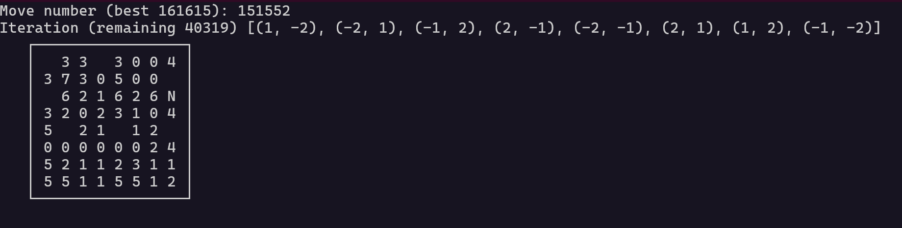

# Knights Tour

Visit the knight to all spaces without revisiting or exceeding the bounds of the board.

## Run 

Runs the first algorithm.

```cli
# python3 main.py
```

Find the best iteration of the algorithm.

```cli
# python3 main.py all
```

## Example



```cli
smathews@SM-S11PRO:~/Projects/github.com/smathews/knights-tour$ python3 main.py all
Solved in 1332 moves
With iteration: [(-1, 2), (1, 2), (2, 1), (1, -2), (2, -1), (-2, -1), (-2, 1), (-1, -2)]
[[1, 1, 1], [2, 3, 0], [1, 5, 1], [2, 7, 2], [4, 8, 3], [5, 6, 1], [6, 8, 3], [7, 6, 1], [8, 8, 5], [6, 7, 3], [7, 5, 1], [8, 7, 5], [6, 6, 0], [5, 8, 4], [7, 7, 3], [8, 5, 5], [6, 4, 3], [7, 2, 1], [8, 4, 5], [6, 3, 0], [5, 5, 0], [4, 7, 5], [2, 6, 0], [1, 8, 4], [3, 7, 3], [4, 5, 1], [5, 7, 2], [7, 8, 3], [8, 6, 5], [6, 5, 3], [7, 3, 3], [8, 1, 6], [6, 2, 0], [5, 4, 0], [4, 6, 0], [3, 8, 5], [1, 7, 3], [2, 5, 3], [3, 3, 3], [4, 1, 1], [5, 3, 2], [7, 4, 3], [8, 2, 5], [6, 1, 6], [4, 2, 5], [2, 1, 0], [1, 3, 2], [3, 4, 7], [2, 2, 0], [1, 4, 2], [3, 5, 3], [4, 3, 3], [5, 1, 6], [3, 2, 1], [4, 4, 0], [3, 6, 0], [2, 8, 7], [1, 6, 3], [2, 4, 7], [1, 2, 4], [3, 1, 2], [5, 2, 4], [7, 1, 1], [8, 3, -1]]
```